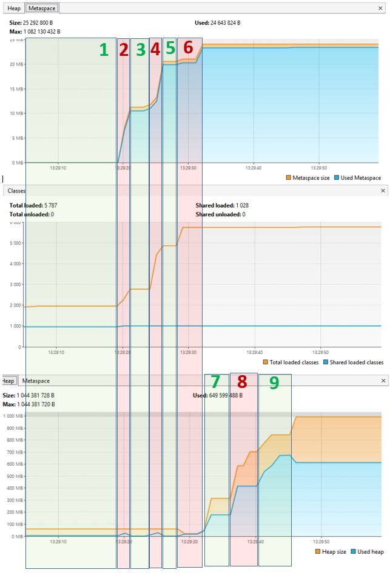

## Задача "Исследование JVM через VisualVM" ##

Программа запускается.

- **ПОЛЕ_1:** 
    Поток остановлен на 30 секунд. `Thread.sleep(30_000);` 

Выполняется первая часть программы по загрузке классов.

- **ПОЛЕ_2:** Вывод в консоль: `13:29:19.516858900: loading io.vertx`. Начинается загрузка классов io.vertx. 

  Начало загрузки поля#2 красного цвета. Объем используемой памяти в Metaspace начинает расти. Также наблюдается рост в области памяти Heap.

  Загрузка классов io.vertx закачивается. 
  Конец загрузки поля#2 красного цвета. 
  
  Вывод в консоль: `13:29:20.883353400: loaded 529 classes`.

  Объем используемой памяти в Metaspace перестает расти. В области памяти Heap в этот момент срабатывают сборщики мусора и объем используемой памяти уменьшается.
 

- **ПОЛЕ_3:** Поток остановлен на 3 секунды. `Thread.sleep(3_000)`;

- **ПОЛЕ_4:** Вывод в консоль: `13:29:23.892939800: loading io.netty`
  Начинается загрузка классов io.netty. 

  Загрузка классов io.netty закачивается. 
  Вывод в консоль: `13:29:25.413047500: loaded 2117 classes`;

- **ПОЛЕ_5:** Поток остановлен на 3 секунды. `Thread.sleep(3_000)`;

- **ПОЛЕ_6:** Вывод в консоль: `13:29:28.421178800: loading org.springframework`.
  Начинается загрузка классов org.springframework.

  Загрузка классов org.springframework закачивается.
  Вывод в консоль: `13:29:29.001815300: loaded 869 classes`.

*Таким образом после первой части кода мы наблюдаем на графике Metaspace характерные «ступеньки», которые характеризуют выполнение метода `loadToMetaspaceAllFrom` три раза.*

Далее выполняется вторая часть программы по созданию классов.

- **ПОЛЕ_7:** Вывод в консоль: `13:29:32.010926800: creating 5000000 objects`.

  Создание 5_000_000 объектов.
Вывод в консоль: `13:29:33.247524800: created`.

  Поток остановлен на 3 секунды. `Thread.sleep(3_000)`;

- **ПОЛЕ_8:** Вывод в консоль: `13:29:36.251686800: creating 5000000 objects`.

  Создание 5_000_000 объектов.
Вывод в консоль: `13:29:37.001115600: created`.

  Поток остановлен на 3 секунды. `Thread.sleep(3_000)`;

- **ПОЛЕ_9:**
Вывод в консоль: 13:29:40.576993900: creating 5000000 objects.

  Создание 5_000_000 объектов.
Вывод в консоль: `13:29:42.847642200: created`.

  Поток остановлен на 3 секунды. `Thread.sleep(3_000)`;

*Здесь мы также наблюдаем 3 ступени в области памяти Heap, т.к. метод по созданию объектов `createSimpleObjects` вызывается 3 раза. Далее срабатывают сборщики мусора и часть памяти “кучи” очищаются.*

**Таким образом мы можем сделать вывод, что при добавлении классов использовалась область памяти Metaspace, тк в этой области хранятся данные о загруженных классах, а при создании объектов область памяти Heap, тк сами созданные объекты хранятся в «куче».**
